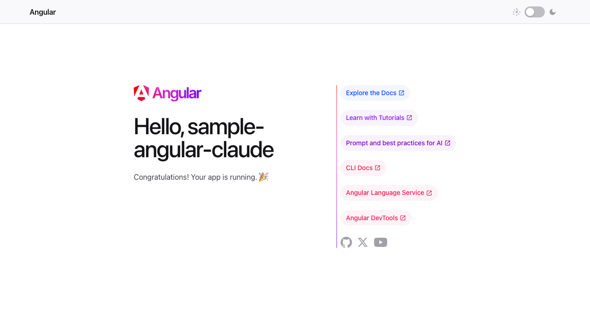
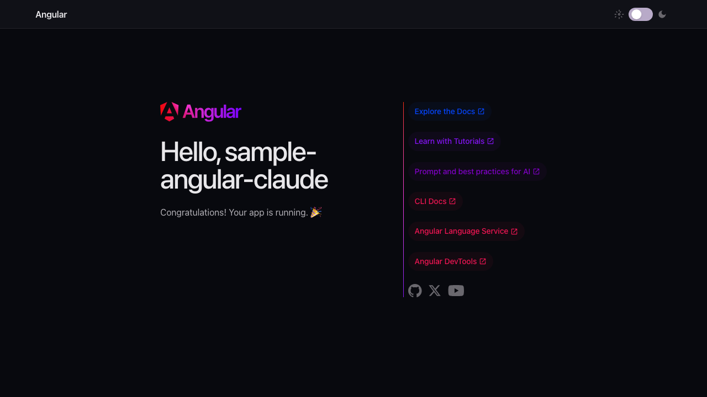

# sample-angular-claude

An Angular 19 starter app with a full dark/light mode theme system built with Tailwind CSS v4.

## Screenshots

| Light Mode | Dark Mode |
|---|---|
|  |  |

## Features

- **Dark / Light mode toggle** — pill-shaped switch in the header with sun and moon icons
- **System preference detection** — defaults to your OS dark/light setting on first visit
- **Persistent preference** — stores your choice in `localStorage` across sessions
- **No flash on reload** — an inline script applies the saved theme before Angular boots
- **Smooth transitions** — 250ms ease on background, text, and border colors

## Tech Stack

- [Angular 19](https://angular.dev) with SSR (Angular Universal)
- [Tailwind CSS v4](https://tailwindcss.com)
- TypeScript
- CSS custom properties for theming (`oklch` color space)

## Getting Started

```bash
npm install
ng serve
```

Open [http://localhost:4200](http://localhost:4200).

## Project Structure

```
src/
├── app/
│   ├── app.ts              # Root component — injects ThemeService
│   ├── app.html            # Template with header toggle + dark mode CSS vars
│   ├── app.css             # Header and toggle styles
│   ├── theme.service.ts    # Manages dark class on <html> + localStorage
│   └── app.routes.ts
├── styles.css              # Global Tailwind import + dark mode root styles
└── index.html              # Anti-flash script in <head>
```

## Theme System

`ThemeService` is an Angular injectable that:

1. Reads `localStorage` for a saved preference on init
2. Falls back to `window.matchMedia('(prefers-color-scheme: dark)')` if no preference is saved
3. Toggles the `dark` class on `<html>` and persists the choice

Component styles use `:host-context(html.dark)` to override CSS custom properties (`--gray-900`, `--gray-700`, `--gray-400`, `--bg`, `--surface`) for the dark palette.

## Build

```bash
ng build
```

## Testing

```bash
ng test   # unit tests (Vitest)
ng e2e    # end-to-end tests
```
